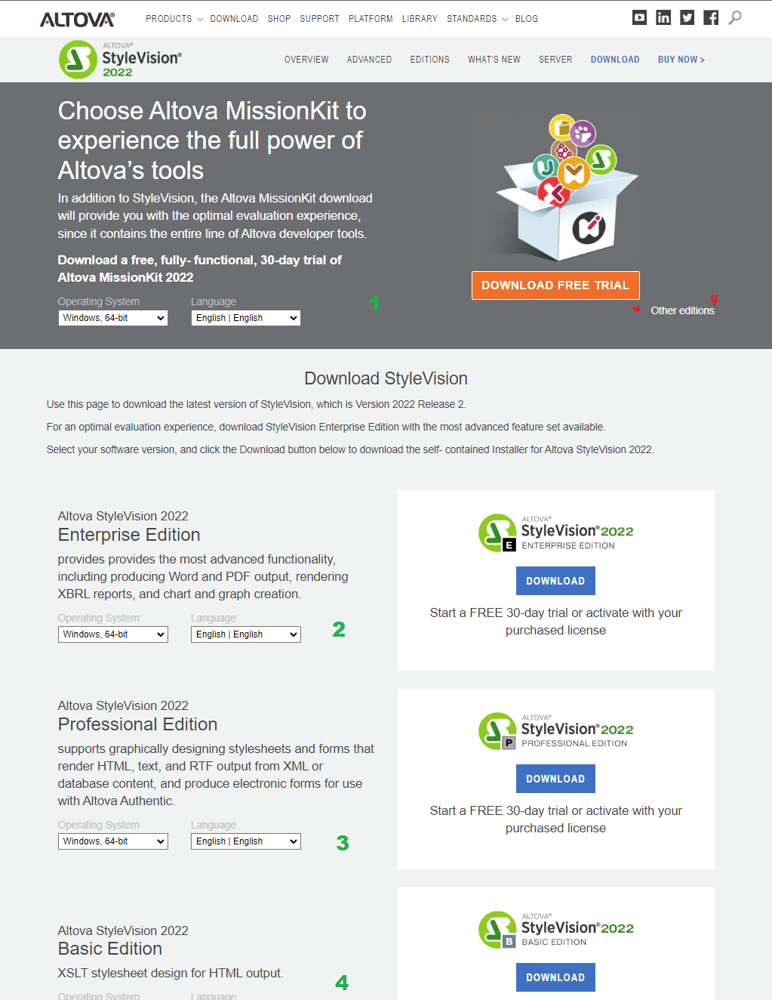

# 1. Installation

This page provides information regarding to local installation of the software Altova StyleVision.

# Table of contents
1. [Pre-requisite](#pre-requisite)


# Pre-requisite
⚠️ Altova StyleVision is a Windows application, there is no installation for other OS.

StyleVision templates can be previewed locally, but it requires the following softwares to be installed:
- Internet Browser such as Edge, Chrome or Firefox for previewing HTML format
- Microsoft Words
- Adobe PDF

🔑 You will need a Altova Licence file or a server address for Server License.

# Download
To install Altova StyleVision, first download the installer. Visit the download page [https://www.altova.com/stylevision/download](https://www.altova.com/stylevision/download).

At the time when this guide was made, Altova StyleVision is on version 2022 release 2.

In the download page you will find multiple options.
1. MissionKit is a package of Altova products. This is helpful for those who are planning to utilize multiple Altova products.
2. Enterprise Edition. If you need to make PDF or Microsoft© Words 2007+ templates this is your best option.
3. Professional Edition. If you don't need to make PDF or Microsoft©  Words 2007+ templates.
4. Basic Edition. Minimal need.

For more details regarding to each version and their comparison can be found [here](https://www.altova.com/stylevision/editions).

```
💡
- Missionkit is available in both Enterprise and Professional edition
- Always check what your license offers in terms of product, editions and versions.
- You can download previous releases, at the bottom of the download page.
```



# Install
Open the installer and run through the installation. It should be self explanatory. (Just click OK 😁).

```
⚠️ If you are installing from a Work Computer, you might not have permission to install un-registered software. Please contact your IT for your support.

💡In case of need, you can try dragging the installer into the C: drive. It will work for some Windows installation where the C drive is excluded from the IT security.
```

After installation is finished. The activation will start itself, or you can trigger it by starting the installed application.


Please select the most suitable activation option for your need.

For those who has an server address for activation, please use the Altova LicenseServer.

After activation your software will start.

<hr>
💭 If you have any questions regarding to license please contact your IT or License Owner for support. If you need some extra guidance, raise an issue in this repository.

<div style="text-align:right;"><a href="../2.Understanding.md">➡️ next chapter</a></div>