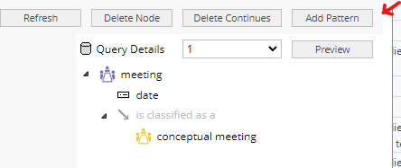

# 2 Understanding of Altova StyleVision

This page provides information regarding to the technology Altova StyleVision use to generate dynamic reports. Also what architecture is in place to generate report on a Relatics Workspace.

# Table of contents
- [How does it Work?](#21-how-does-it-work)
- [Technology](#technology)

## 2.1 How does it Work?

Altova StyleVision is a very smart code editor that lets user drag and drop report components into the canvas. The software will generate XSLT stylesheets codes that makes the template. It is a low-code software that lets anyone create smart report template with minimal understanding of programming.


### Technology
XLST is the main technology Altova StyleVision use. It is a styling programming language for XML.

For beginner please get yourself aquainted with XML(eTensible Markup Language) here : https://www.w3schools.com/xml/xml_whatis.asp
and
XLST here : https://www.w3schools.com/xml/xsl_intro.asp

```
💡 Technically speaking, a XLST expert can generate dynamic report without the use of Altova StyleVision. This can all be done in a text editor like notepad or VS code, just like programming in any other languages.
```


# 2.2 Source contents XSD and XML

In the previous section it is mentioned that the parser requires XSD schema and XML data for generating an output. These are two actual files.
The XSD file contains the data-model & data-structure and the XML file contains the data in tag format.

This two files can be obtained in Relatics through a report query.

Let's go through that with an example. In an example Relatics Workspace there is a table for external meetings. See figure below.


This table presents information such as meeting name, date and type.

Let say we want to generate a report of external meetings in another format. We will be doing that with Altova StyleVision.

To get this data out for development it is quite simple. Just follow this steps:
1. Copy the query pattern from the table.
</br>


2. Create a report in the Workspace studio at the report module
</br>
More information regarding to setting up a report can be found [here](https://kb.relaticsonline.com/published//ShowObject.aspx?Key=21b654a0-4fea-e311-93f4-000af753dd5b).

3. Add copied pattern to ReportPart
</br>

4. specify output to xml and download source contents
</br>

👏 Good job, you have prepared the data. In the next chapter you will learn how to generate the report template with Altova StyleVision.
